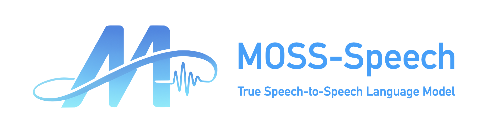
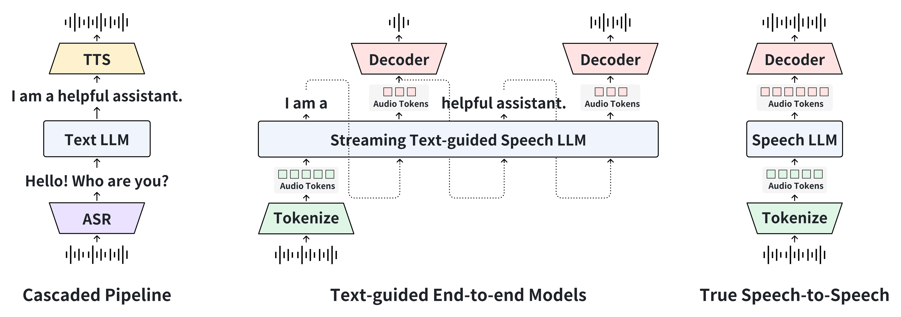
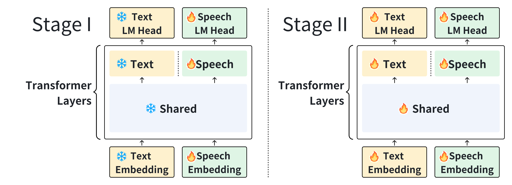
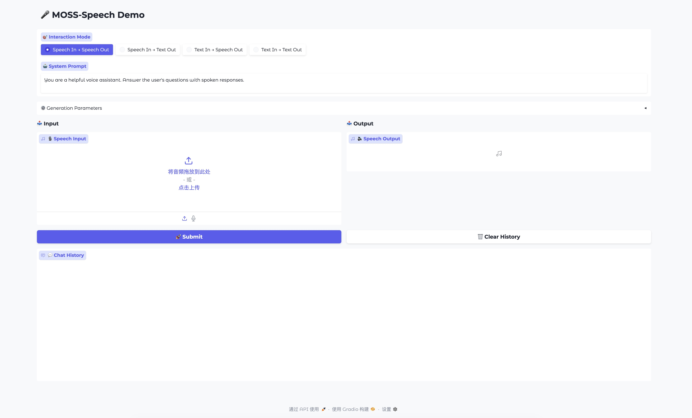

# MOSS-Speech: Towards True Speech-to-Speech Models Without Text Guidance

<div align="center" style="line-height: 1;">
    <a href="https://huggingface.co/spaces/fnlp/MOSS-Speech" target="_blank" style="margin: 2px;">
        
    </a>
    <a href="https://moss-speech.open-moss.com/" target="_blank" style="margin: 2px;">
    
    </a>
    <a href="https://arxiv.org/abs/2510.00499" target="_blank" style="margin: 2px;">
    
    </a>
    <a href="https://huggingface.co/collections/fnlp/moss-speech-68dbab23bc98501afede0cd3" target="_blank" style="margin: 2px;">
        
    </a>
    <a href="https://x.com/Open_MOSS" target="_blank" style="margin: 2px;">
    
    </a>
</div>




阅读[中文](./README_ZH.md)版本.

---

## 📖 Introduction

MOSS-Speech introduces true end-to-end speech interaction. Unlike cascaded pipelines or text-guided models, it directly generates speech without first producing text. Our design not only overcomes the limitation of generated speech being constrained by a text bottleneck, but also inherits the knowledge of the pretrained text language model, thereby enabling more natural and efficient speech-to-speech dialogue.



We add modality-based layer-splitting to a pretrained text LLM, and follow a frozen pre-training strategy to preserve the LLM's capabilities while extending it to speech modality.


Check out our [video demo](https://moss-speech.open-moss.com/) and [live demo](https://huggingface.co/spaces/fnlp/MOSS-Speech).

Technical report is available at [arXiv:2510.00499](https://arxiv.org/abs/2510.00499).

---

## 🔑 Key Features


- **True Speech-to-Speech Modeling**: No text guidance required.  
- **Layer-Splitting Architecture**: Integrates modality-specific layers on top of pretrained text LLM backbones.
- **Frozen Pre-Training Strategy**: Preserves LLM abilities while extending to speech modality.
- **State-of-the-Art Performance**: Excels in spoken question answering and speech-to-speech tasks.

---

## 🛠️ Installation

```bash
# Clone the repository
git clone https://github.com/OpenMOSS/MOSS-Speech
cd MOSS-Speech

# Install dependencies
pip install -r requirements.txt 
git submodule update --init --recursive
```

---

## 🚀 Usage
Launch the web demo
```sh
python3 gradio_demo.py
```

<p align="center">
     <br>
</p>


---

## Next Steps

- [ ] **Open source base model**: Release the MOSS-Speech-Base model for community use
- [ ] **Support streaming output in Gradio**: Implement streaming output for lower response latency in the web demo

---

## License
- The code in this repository is released under the [Apache 2.0](LICENSE) license.

---

## Acknowledgements
- [Qwen](https://github.com/QwenLM/Qwen3): We use Qwen3-8B as the base model.
- We thank an anonymous colleague for Character Voice!

---

## 📜 Citation

If you use this repository or model in your research, please cite:

```bibtex
@misc{zhao2025mossspeechtruespeechtospeechmodels,
      title={MOSS-Speech: Towards True Speech-to-Speech Models Without Text Guidance}, 
      author={Xingjian Zhao and Zhe Xu and Luozhijie Jin and Yang Wang and Hanfu Chen and Yaozhou Jiang and Ke Chen and Ruixiao Li and Mingshu Chen and Ruiming Wang and Wenbo Zhang and Yiyang Zhang and Donghua Yu and Yang Gao and Xiaogui Yang and Yitian Gong and Yuanfan Xu and Qinyuan Cheng and Zhaoye Fei and Shimin Li and Yaqian Zhou and Xuanjing Huang and Xipeng Qiu},
      year={2025},
      eprint={2510.00499},
      archivePrefix={arXiv},
      primaryClass={cs.CL},
      url={https://arxiv.org/abs/2510.00499}, 
}
```
