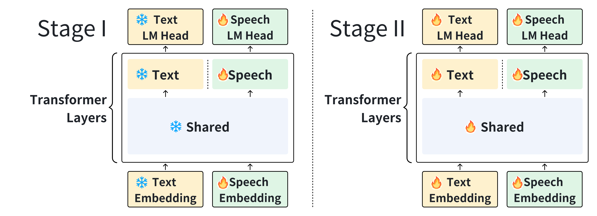

# MOSS-Speech: Towards True Speech-to-Speech Models Without Text Guidance

<div align="center" style="line-height: 1;">
    <a href="https://huggingface.co/spaces/fnlp/MOSS-Speech" target="_blank" style="margin: 2px;">
        
    </a>
    <a href="https://moss-speech.open-moss.com/" target="_blank" style="margin: 2px;">
    
    </a>
    <a href="papers/MOSS-Speech Technical Report.pdf" target="_blank" style="margin: 2px;">
    
    </a>
    <a href="https://huggingface.co/collections/fnlp/moss-speech-68dbab23bc98501afede0cd3" target="_blank" style="margin: 2px;">
        
    </a>
    <a href="https://x.com/Open_MOSS" target="_blank" style="margin: 2px;">
    
    </a>
</div>


Read this in [English](./README.md).

---

## 📖 引言

MOSS-Speech 开创了真语音到语音交互范式。与传统的级联管线或依赖文本引导的模型不同，它能够直接生成语音，而无需先产生文本。我们的设计不仅解决了生成的声音内容受到文本瓶颈限制的问题，还继承了预训练文本大模型的知识，从而实现更加自然、高效的语音到语音对话。


我们在预训练文本大模型的基础上，引入了基于模态的分层机制，并采用冻结预训练策略，在扩展语音能力的同时，最大程度保留了原有语言模型的推理与知识能力。  



欢迎查看我们系统的[演示视频](https://moss-speech.open-moss.com/)和[在线演示](https://huggingface.co/spaces/fnlp/MOSS-Speech)

---

## 🔑 核心特性

- **真正的语音到语音建模**：无需文本引导。  
- **层拆分架构**：在预训练文本 LLM 的基础上新增模态特定层。
- **冻结预训练策略**：在保留原 LLM 的能力的同时引入语音理解和生成能力。  
- **SOTA性能**：在语音问答和语音到语音任务中表现出色。

---

## 🛠️ 安装

```bash
# Clone the repository
git clone https://github.com/OpenMOSS/MOSS-Speech
cd MOSS-Speech

# Install dependencies
pip install -r requirements.txt
git submodule update --init --recursive
```

---

## 🚀 使用
### 启动网页demo

```sh
python3 gradio_demo.py
```

<p align="center">
     <br>
</p>

---

## 下一步计划

- [ ] **开源基座模型**：发布 MOSS-Speech-Base 模型供社区使用
- [ ] **支持 Gradio 流式输出**：在 Gradio 中实现流式输出，实现更低的输出延迟


---

## 协议
- 本开源仓库的代码遵循 [Apache 2.0](LICENSE) 协议。

---

## 致谢
- [Qwen](https://github.com/QwenLM/Qwen3): 我们以 Qwen3-8B 作为基座模型。
- 感谢一位匿名的同事给我们提供声音!

---

## 📜 引用

如果在研究中使用本仓库或模型，请引用如下文献：

```bibtex
@misc{moss_speech2025,
  author = {SII OpenMOSS Team},
  title = {MOSS-Speech: Towards True Speech-to-Speech Models Without Text Guidance},
  year = {2025},
  publisher = {GitHub},
  journal = {GitHub repository},
  howpublished = {\url{https://github.com/OpenMOSS/MOSS-Speech}},
}
```
