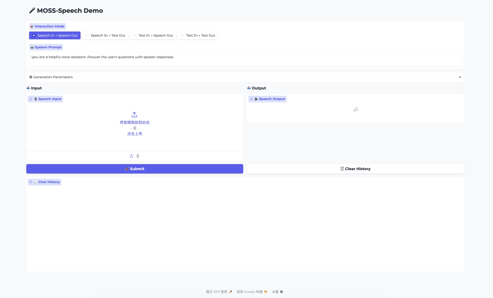

# MOSS-Speech: Towards True Speech-to-Speech Models Without Text Guidance

<div align="center" style="line-height: 1;">
    <a href="https://huggingface.co/spaces/fnlp/MOSS-Speech" target="_blank" style="margin: 2px;">
        
    </a>
    <a href="https://moss-speech.open-moss.com/" target="_blank" style="margin: 2px;">
    
    </a>
    <a href="https://arxiv.org/abs/2510.00499" target="_blank" style="margin: 2px;">
    
    </a>
    <a href="https://huggingface.co/collections/fnlp/moss-speech-68dbab23bc98501afede0cd3" target="_blank" style="margin: 2px;">
        
    </a>
    <a href="https://x.com/Open_MOSS" target="_blank" style="margin: 2px;">
    
    </a>
</div>


Read this in [English](./README.md).

---

## 📖 引言

MOSS-Speech 开创了真语音到语音交互范式。与传统的级联管线或依赖文本引导的模型不同，它能够直接生成语音，而无需先产生文本。我们的设计不仅解决了生成的声音内容受到文本瓶颈限制的问题，还继承了预训练文本大模型的知识，从而实现更加自然、高效的语音到语音对话。


我们在预训练文本大模型的基础上，引入了基于模态的分层机制，并采用冻结预训练策略，在扩展语音能力的同时，最大程度保留了原有语言模型的推理与知识能力。  


欢迎查看我们系统的[演示视频](https://moss-speech.open-moss.com/)和[在线演示](https://huggingface.co/spaces/fnlp/MOSS-Speech)。

技术报告 [arXiv:2510.00499](https://arxiv.org/abs/2510.00499)。

---

## 🔑 核心特性

- **真正的语音到语音建模**：无需文本引导。  
- **层拆分架构**：在预训练文本 LLM 的基础上新增模态特定层。
- **冻结预训练策略**：在保留原 LLM 的能力的同时引入语音理解和生成能力。  
- **SOTA性能**：在语音问答和语音到语音任务中表现出色。

---

## 🛠️ 安装

```bash
# Clone the repository
git clone https://github.com/OpenMOSS/MOSS-Speech
cd MOSS-Speech

# Install dependencies
pip install -r requirements.txt
git submodule update --init --recursive
```

---

## 🚀 使用
### 启动网页demo

```sh
python3 gradio_demo.py
```

<p align="center">
     <br>
</p>

---

## 下一步计划

- [ ] **开源基座模型**：发布 MOSS-Speech-Base 模型供社区使用
- [ ] **支持 Gradio 流式输出**：在 Gradio 中实现流式输出，实现更低的输出延迟


---

## 协议
- 本开源仓库的代码遵循 [Apache 2.0](LICENSE) 协议。

---

## 致谢
- [Qwen](https://github.com/QwenLM/Qwen3): 我们以 Qwen3-8B 作为基座模型。
- 感谢一位匿名的同事给我们提供声音!

---

## 📜 引用

如果在研究中使用本仓库或模型，请引用如下文献：

```bibtex
@misc{zhao2025mossspeechtruespeechtospeechmodels,
      title={MOSS-Speech: Towards True Speech-to-Speech Models Without Text Guidance}, 
      author={Xingjian Zhao and Zhe Xu and Luozhijie Jin and Yang Wang and Hanfu Chen and Yaozhou Jiang and Ke Chen and Ruixiao Li and Mingshu Chen and Ruiming Wang and Wenbo Zhang and Yiyang Zhang and Donghua Yu and Yang Gao and Xiaogui Yang and Yitian Gong and Yuanfan Xu and Qinyuan Cheng and Zhaoye Fei and Shimin Li and Yaqian Zhou and Xuanjing Huang and Xipeng Qiu},
      year={2025},
      eprint={2510.00499},
      archivePrefix={arXiv},
      primaryClass={cs.CL},
      url={https://arxiv.org/abs/2510.00499}, 
}
```
